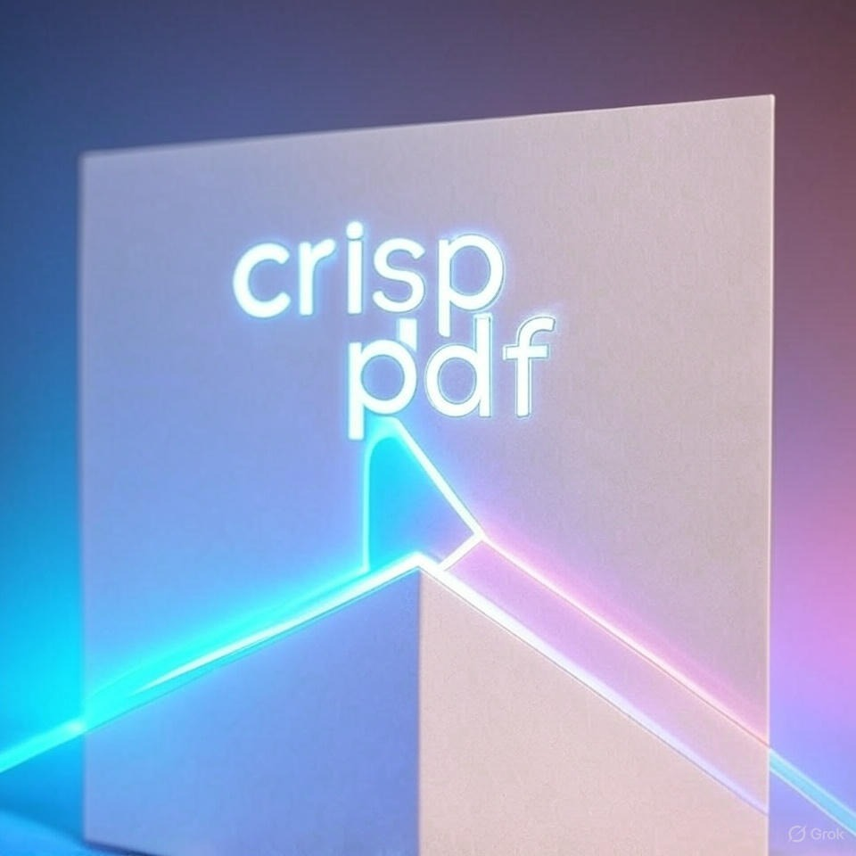

# CrispPDF - Professional PDF Editor

A modern, feature-rich PDF editor built with Next.js, React, and TypeScript. Edit, annotate, sign, and customize PDFs with an intuitive interface and advanced drawing tools.



## ✨ Features

### Core Functionality
- 📄 **PDF Upload** - Drag & drop or click to upload PDF files
- ✍️ **Text Editing** - Add and edit text with custom fonts and styles
- ✒️ **Signatures** - Draw or type signatures with history for reuse
- 📅 **Date Stamps** - Insert current date stamps
- 💾 **Save & Download** - Export edited PDFs

### Advanced Drawing Tools
- 🎨 **6 Brush Styles** - Regular, Calligraphy, Marker, Pencil, Airbrush, Crayon
- 📐 **10 Shape Types** - Rectangle, Circle, Line, Triangle, Arrow, Diamond, Pentagon, Hexagon, Star, Heart
- 🎨 **Color Customization** - Fill and stroke colors with 15 presets + custom hex
- 🌈 **Opacity Control** - Adjust transparency for shapes
- 📏 **Stroke Width** - Adjustable line thickness (1-10px)
- 🗑️ **Eraser Tool** - Click-to-delete elements

### UX Enhancements
- ♻️ **Signature History** - Stores your last 10 signatures in browser
- 🔄 **Resizable Signatures** - Drag corner handles to resize
- 🎯 **Hover Delete** - Delete buttons appear on element hover
- 🎨 **Conditional Controls** - Color pickers show only for shape tools

## 🚀 Getting Started

### Prerequisites
- Node.js 18+ and npm

### Installation

1. Clone the repository:
```bash
git clone <your-repo-url>
cd pdf_editor
```

2. Install dependencies:
```bash
npm install
```

3. Run the development server:
```bash
npm run dev
```

4. Open [http://localhost:3000](http://localhost:3000) in your browser

## 🛠️ Tech Stack

- **Framework**: Next.js 14.2.15
- **UI Library**: React 18.3.1
- **Language**: TypeScript
- **Styling**: Tailwind CSS v3
- **PDF Library**: react-pdf + pdf-lib
- **Icons**: Lucide React
- **Storage**: Local Storage (for signature history)

## 📂 Project Structure

```
pdf_editor/
├── app/                    # Next.js app router
│   ├── globals.css        # Global styles
│   ├── layout.tsx         # Root layout
│   └── page.tsx           # Home page
├── components/            # React components
│   ├── pdf-editor.tsx     # Main editor component
│   ├── pdf-viewer.tsx     # PDF rendering
│   ├── draggable-element.tsx # Movable elements
│   ├── drawing-canvas.tsx # Shape/brush drawing
│   ├── toolbar.tsx        # Main toolbar
│   ├── color-picker.tsx   # Color selection
│   ├── brush-selector.tsx # Brush styles
│   ├── shape-selector.tsx # Shape grid
│   └── signature-modal.tsx # Signature creation
├── lib/                   # Utility functions
│   ├── types.ts          # TypeScript interfaces
│   ├── pdf-utils.ts      # PDF manipulation
│   └── signature-storage.ts # LocalStorage utils
└── public/               # Static assets
    └── crisp-pdf-bg.jpg  # Brand background

```

## 🎨 Usage Guide

### Basic Workflow
1. **Upload PDF** - Drag & drop or click to select a PDF file
2. **Add Elements** - Click toolbar buttons (Text, Signature, Date)
3. **Draw Shapes** - Select shape from dropdown, choose colors, draw on PDF
4. **Customize** - Adjust colors, stroke width, brush styles
5. **Edit** - Double-click elements to edit, drag to move
6. **Delete** - Hover and click X button, or use Eraser tool
7. **Save** - Click "Save PDF" to download

### Drawing with Shapes
1. Click "Shapes" dropdown
2. Select desired shape
3. Fill and stroke color pickers appear automatically
4. Adjust colors and width
5. Click and drag on PDF to create shape

### Signature History
- New signatures automatically save to history
- Access via "History" tab in signature modal
- Click saved signature to reuse
- Delete individual signatures or clear all

## 🌐 Deployment

### Build for Production
```bash
npm run build
npm start
```

### Deploy to Vercel
The easiest way to deploy is using Vercel:

[](https://vercel.com/new)

## 📝 License

This project is open source and available under the MIT License.

## 🤝 Contributing

Contributions, issues, and feature requests are welcome!

## 👨‍💻 Author

Created with ❤️ for PDF editing enthusiasts

---

**CrispPDF** - Edit PDFs with precision and style ✨
